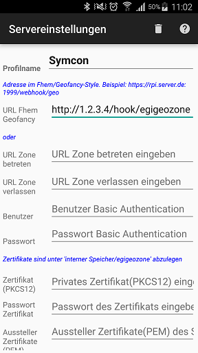
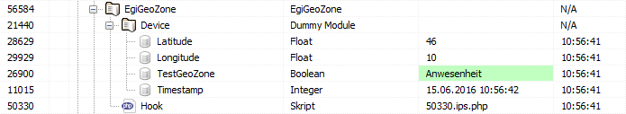

# EgiGeoZone
Das Modul dient zum empfangen von EgiGeoZone Daten.

### Inhaltverzeichnis

1. [Funktionsumfang](#1-funktionsumfang)
2. [Voraussetzungen](#2-voraussetzungen)
3. [Software-Installation](#3-software-installation)
4. [Einrichten der Instanzen in IP-Symcon](#4-einrichten-der-instanzen-in-ip-symcon)
5. [Statusvariablen und Profile](#5-statusvariablen-und-profile)
6. [WebFront](#6-webfront)
7. [PHP-Befehlsreferenz](#7-php-befehlsreferenz)
8. [Anhang](#8-anhang)

### 1. Funktionsumfang

* Pro Gerät eine eigene Standortliste
* Benutzername und Passwort Identifikation innerhalb von IP-Symcon.
* Richtet automatisch den Webhook "/hook/egigeozone" ein.
 * Es wird empfohlen dies in Kombination mit dem Connect Modul zu nutzen.

### 2. Voraussetzungen

- IP-Symcon ab Version 4.x
- EgiGeoZone App für Google Android

### 3. Software-Installation

Über das Modul-Control folgende URL hinzufügen.
`git://github.com/symcon/SymconMisc.git`

### 4. Einrichten der Instanzen in IP-Symcon

- Unter "Instanz hinzufügen" ist das 'EgiGeoZone'-Modul unter dem Hersteller '(Kern)' aufgeführt.

__Konfigurationsseite__:

Name         | Beschreibung
------------ | ---------------------------------
Benutzername | Benutzername, welcher in der EgiGeoZone App angegeben werden muss, um IP-Symcon Daten schicken zu können.
Passwort     | Passwort, welches in der EgiGeoZone App angeben werden muss.

_Werden diese Daten Leer gelassen kann jeder über den Hook Daten an IP-Symcon schicken._

### 5. Statusvariablen und Profile

Die Statusvariablen/Kategorien werden automatisch angelegt. Das Löschen einzelner kann zu Fehlfunktionen führen.

##### Statusvariablen
Die Variablen werden anhand der Geräte ID und beim erstmaligen senden innerhalb des EgiGeoZone Moduls automatisch angelegt. Es können mehrere Geräte über einen Hook laufen. Jedes Gerät wird unter seiner eigenen "Kategorie" eingerichtet.

Name                           | Typ             | Beschreibung
------------------------------ | --------------- | ----------------
Gerätename                     | Instanz (Dummy) | Dient als "Kategorie" in der sich alle überwachten Standorte, sowie der Zeitstempel und Längen-/Breitengrad befinden. Wird pro Gerät erstellt.
Latitude                       | Float           | Breitengrad der letzten Aktivität.
Longitude                      | Float           | Längengrad der letzten Aktivität.
Timestamp                      | Integer         | UnixTimestamp der letzten Aktivität.
Beispielstandort (GeoZoneTest) | Boolean         | Present oder Absent. Information wird von Gefency geliefert.

Beispiel:

##### Profile:

Es werden keine zusätzlichen Profile hinzugefügt

### 6. WebFront

Es gibt keine native Darstellung via WebFront oder in den mobilen Apps.
Geräte und Variablen, welche angezeigt werden sollen, können via Link angezeigt werden.

### 7. PHP-Befehlsreferenz

Es sind keine PHP-Skriptbefehle vorhanden.
