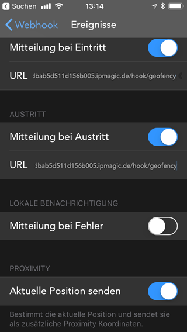
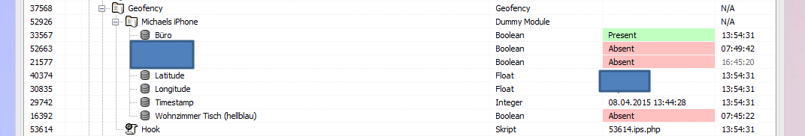

# Geofency
Das Modul dient zum empfangen von Geofency Daten.

### Inhaltverzeichnis

1. [Funktionsumfang](#1-funktionsumfang)
2. [Voraussetzungen](#2-voraussetzungen)
3. [Software-Installation](#3-software-installation)
4. [Geofency Konfiguration](#4-geofency-konfiguration)
5. [Einrichten der Instanzen in IP-Symcon](#5-einrichten-der-instanzen-in-ip-symcon)
6. [Statusvariablen und Profile](#6-statusvariablen-und-profile)
7. [WebFront](#7-webfront)
8. [PHP-Befehlsreferenz](#8-php-befehlsreferenz)
9. [Anhang](#9-anhang)

### 1. Funktionsumfang

* Pro Gerät eine eigene Standortliste
* Benutzername und Passwort Identifikation innerhalb von IP-Symcon.
* Richtet automatisch den Webhook "/hook/geofency" ein.
* Es wird empfohlen dies in Kombination mit dem Connect Modul zu nutzen.
* Optional kann der aktuelle Standort von Geofency übermittelt werden

### 2. Voraussetzungen

- IP-Symcon ab Version 4.x
- Geofency App für Apple iOS

### 3. Software-Installation

Über das Modul-Control folgende URL hinzufügen.
`git://github.com/paresy/SymconMisc.git`

### 4. Geofency Konfiguration

In der Geofency App mit + einen neuen Standort hinzufügen. Dann auf die 3 Punkte rechts klicken um das Menü zu öffnen.
Hier ist _Webhook_ auszuwählen.

#### Event

Als URL wird jeweils die Domain eingetragen unter der IP-Symcon zu erreichen ist gefolgt von _/hook/geofency_
Am einfachtsen ist es dort die IP-Symcon Connect Adresse einzutragen gefolgt von _/hook/geofency_

Optional kann _Aktuelle Position senden_ aktiviert werden.

#### POST Format
Einstellung bleibt auf _Default_, JSON-enkodiert ist _deaktiv_ und wird  nicht ausgewählt

#### Authentifizierung
Name         | HTTP Basic Authentifizierung
------------ | ---------------------------------
Username     | Der Webhook Benutzername der dann in IP-Symcon hinterlegt wird
Passwort     | Das Webhook Passwort das dann in IP-Symcon hinterlegt wird 

### 5. Einrichten der Instanzen in IP-Symcon

- Unter "Instanz hinzufügen" ist das 'Geofency'-Modul unter dem Hersteller '(Kern)' aufgeführt.

__Konfigurationsseite__:

Name         | Beschreibung
------------ | ---------------------------------
Benutzername | Benutzername, welcher in der Geofency App angegeben werden muss, um IP-Symcon Daten schicken zu können.
Passwort     | Passwort, welches in der Geofency App angeben werden muss.

_Werden diese Daten Leer gelassen kann jeder über den Hook Daten an IP-Symcon schicken._

### 6. Statusvariablen und Profile

Die Statusvariablen/Kategorien werden automatisch angelegt. Das Löschen einzelner kann zu Fehlfunktionen führen.

##### Statusvariablen
Die Variablen werden anhand der Geräte ID und beim erstmaligen senden innerhalb des Geofency Moduls automatisch angelegt. Es können mehrere Geräte über einen Hook laufen. Jedes Gerät wird unter seiner eigenen "Kategorie" eingerichtet.

Name                    | Typ             | Beschreibung
----------------------- | --------------- | ----------------
Gerätename              | Instanz (Dummy) | Dient als "Kategorie" in der sich alle überwachten Standorte, sowie der Zeitstempel und Längen-/Breitengrad befinden. Wird pro Gerät erstellt.
Latitude                | Float           | Breitengrad der letzten Aktivität.
Longitude               | Float           | Längengrad der letzten Aktivität.
Timestamp               | Integer         | UnixTimestamp der letzten Aktivität.
Beispielstandort (Büro) | Boolean         | Present oder Absent. Information wird von Gefency geliefert.
aktuelle Longitude      | Float           | Aktueller Breitengrad
aktuelle Latitude       | Float           | Aktueller Längengrad

Beispiel:

##### Profile:

Es werden keine zusätzlichen Profile hinzugefügt

### 7. WebFront

Es gibt keine native Darstellung via WebFront oder in den mobilen Apps.
Geräte und Variablen, welche angezeigt werden sollen, können via Link angezeigt werden.

### 8. PHP-Befehlsreferenz

Es sind keine PHP-Skriptbefehle vorhanden.
